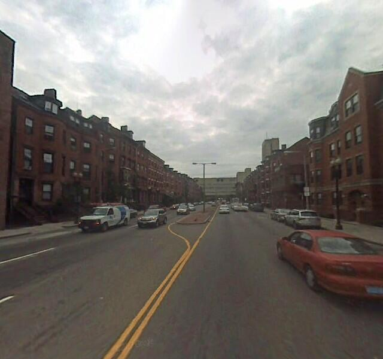
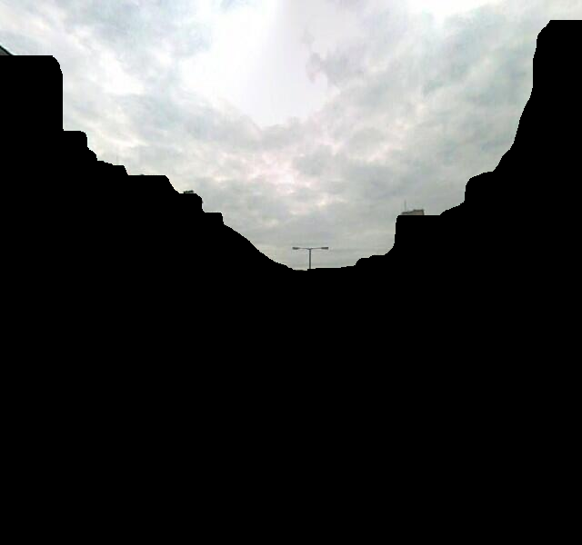
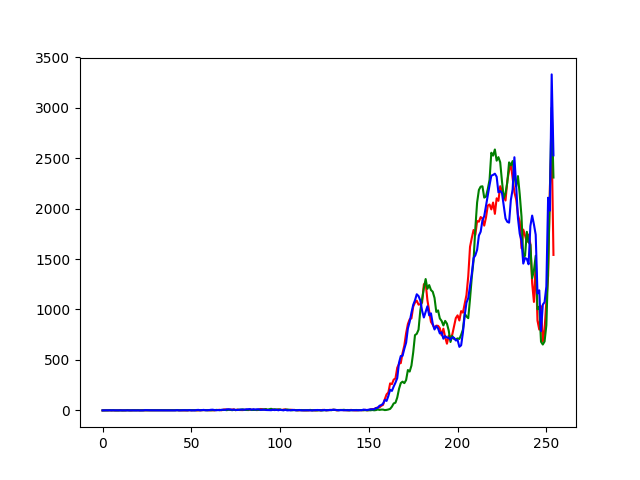

# skyComparison

Detect the sky and use RGB histograms to compare two images of the sky. This simple pipeline was implemented in order to identify images from a sequence of images that were not consistent in either time nor place.

The detection is obtained using a pre-trained network followed by a set of morphological image operations that have been adapted for sky detection.

  
   
  

A color histogram is the calculated for the sky in each image.

  

The histograms associated to an image can be compared using the histogram correlation. 
